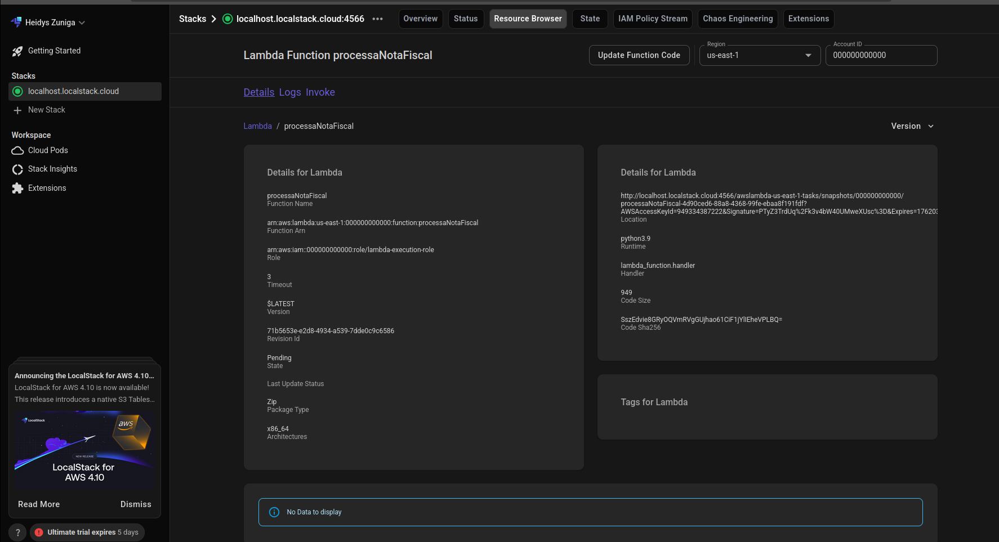

# aws-lambda-s3-localstack
Automação de tarefas com AWS Lambda e S3 simulada localmente usando LocalStack.

AWS Serverless Pipeline Local com LocalStack

Este projeto demonstra um pipeline completo de processamento de dados sem servidor: Amazon S3 → AWS Lambda → Amazon DynamoDB, utilizando o LocalStack para simular a infraestrutura da AWS em ambiente local.

1. Estrutura do Projeto
A organização do projeto segue as melhores práticas, separando o código-fonte (src/) da configuração (raiz).

/AWS-LAMBDA-S3-LOCALSTACK
├── .gitignore         # Lista de arquivos para ignorar (e.g., binários e persistência local)
├── README.md          # Este arquivo
├── docker-compose.yml # Configuração do LocalStack e serviços AWS
├── test.sh            # Script de teste (verifica S3 -> Lambda -> DynamoDB)
└── src/
    └── lambda_function.py # Código Python da função Lambda

2. Pré-requisitos e Inicialização
Certifique-se de que o Docker e o AWS CLI estejam instalados.

2.1. Iniciar o LocalStack
O docker-compose.yml inicia o LocalStack com os serviços S3, Lambda, DynamoDB e IAM habilitados.

# Navegue para a pasta do projeto
cd /caminho/para/seu/projeto

# Inicia o LocalStack em segundo plano
docker compose up -d

2.2. Configuração do AWS CLI

O perfil localstack foi configurado para direcionar todos os comandos para o LocalStack (porta 4566).

aws configure set aws_access_key_id "test" --profile localstack
aws configure set aws_secret_access_key "test" --profile localstack
aws configure set region "us-east-1" --profile localstack

3. Comandos de Implantação de Infraestrutura (Deploy)

Estes comandos recriam todos os recursos necessários no LocalStack.

Criar Tabela DynamoDB:
aws dynamodb create-table --table-name NotasFiscais --key-schema AttributeName=NumeroNota,KeyType=HASH --attribute-definitions AttributeName=NumeroNota,AttributeType=S --provisioned-throughput ReadCapacityUnits=5,WriteCapacityUnits=5 --endpoint-url http://localhost:4566 --profile localstack

Criar Bucket S3	aws s3:
mb s3://meu-primeiro-bucket-local --endpoint-url http://localhost:4566 --profile localstack

Empacotar o Código:
zip lambda_function.zip src/lambda_function.py

Criar Função Lambda:
aws lambda create-function --function-name processaNotaFiscal --runtime python3.11 --role arn:aws:iam::000000000000:role/irrelevant --handler lambda_function.handler --zip-file fileb://lambda_function.zip --endpoint-url http://localhost:4566 --profile localstack

Configurar Gatilho S3:
aws s3api put-bucket-notification-configuration --bucket meu-primeiro-bucket-local --notification-configuration '{"LambdaFunctionConfigurations": [ { "LambdaFunctionArn": "arn:aws:lambda:us-east-1:000000000000:function:processaNotaFiscal", "Events": ["s3:ObjectCreated:*"] } ]}' --endpoint-url http://localhost:4566 --profile localstack

Conceder Permissão (se necessário)
aws lambda add-permission --function-name processaNotaFiscal --statement-id s3-invoke --action "lambda:InvokeFunction" --principal s3.amazonaws.com --source-arn arn:aws:s3:::meu-primeiro-bucket-local --endpoint-url http://localhost:4566 --profile localstack

4. Prova Final de Funcionamento (End-to-End Test)
Esta etapa prova que o upload para o S3 aciona a Lambda, que, por sua vez, salva os dados no DynamoDB.

A. Executar o Teste Automatizado
O script test.sh realiza o upload e verifica o DynamoDB.

# 1. Conceder permissão (se necessário, devido à natureza do ambiente Linux)
chmod +x test.sh

# 2. Executar o teste
./test.sh

B. Prova de Sucesso no DynamoDB
O comando final de teste busca o item nota-automatica no banco de dados. A presença deste JSON confirma o sucesso do fluxo.

Comando de Verificação:

aws dynamodb get-item \

--table-name NotasFiscais \

--key "{\"NumeroNota\": {\"S\": \"nota-automatica\"}}" \

--endpoint-url http://localhost:4566 \
--profile localstack

Resultado Esperado:

{
    "Item": {
        "Status": {
            "S": "Processado com Sucesso"
        },
        "NumeroNota": {
            "S": "nota-automatica"
        }
        // ... outros campos ...
    }
}

## 5. 📸 Prova Visual dos Resultados

As imagens abaixo confirmam a criação da infraestrutura no LocalStack e o sucesso do fluxo de dados S3 → Lambda → DynamoDB.

### 5.1. Tabela DynamoDB Criada

A criação da tabela `NotasFiscais` no ambiente local.

O que o fluxo faz:
quando um arquivo JSON de nota fiscal é carregado no S3, ele dispara a função Lambda processaNotaFiscal (mostrada no LocalStack), que então extrai o NumeroNota e grava os detalhes simplificados na tabela NotasFiscais do DynamoDB (criada via CLI).

### 5.2. Confirmação do Item Processado

Resultado do comando `aws lambda function `, provando que a Lambda executou.

 Tudo isso está sendo testado e executado localmente graças ao LocalStack.

## 6. 🔗 Referências e Documentação

* **LocalStack Documentation:** [https://docs.localstack.cloud/](https://docs.localstack.cloud/

* **AWS CLI Command Reference:** [https://awscli.amazonaws.com/v2/documentation/api/latest/index.html](https://awscli.amazonaws.com/v2/documentation/api/latest/index.html)

* **AWS DynamoDB:** [Introdução ao Amazon DynamoDB](https://aws.amazon.com/pt/dynamodb/)